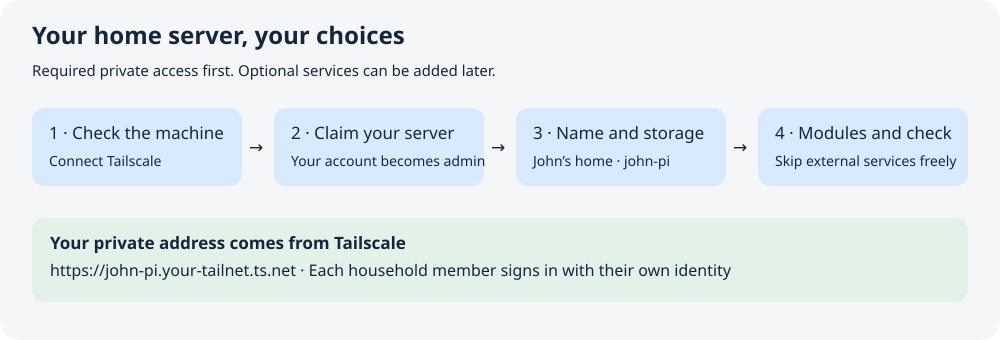

# David-Pi

A private household server for photos, videos, files, notes, recipes, watchlists,
audiobooks, games, household chat and Android phone backup. Use your own website
name—such as **John’s home**—and a Tailscale hostname such as **john-pi**.

**Testing release: 10.0.0-beta.1.** This beta is for people helping test installation
and the Android companion before the stable release. Follow the
[beta installation and feedback guide](docs/TESTING.md); use its download only
when that exact version appears as a GitHub **Pre-release**. Physical Pi/Android
and newcomer feedback are part of the beta, not prerequisites for offering it.
Older GitHub downloads use the previous installer. See [release status](docs/RELEASE.md).



## What you need

- Raspberry Pi 4/5 running 64-bit Raspberry Pi OS based on Debian 13, or an
  Intel/AMD PC running Debian 13 or Ubuntu Server 24.04 LTS.
- At least 4 GB memory, two CPU cores and 8 GiB free OS space; additional space
  for household content. Ethernet is recommended.
- A Tailscale account and Tailscale on the phone/computer used for setup.
- An existing folder on a local ext4 filesystem or a prepared local ext4 drive.
  A separate backup drive is recommended and can be added later.

Each member uses their own Tailscale identity and must be admitted to the portal.
Tailscale is required. Movie search, online recipes, browser notifications and
Pi-hole are optional. A manual movie watchlist and local recipes work without
provider accounts. No streaming-service passwords are needed.

## Install the explicitly selected testing release

Open an interactive terminal on the server (or connect to it with SSH), then run:

```sh
curl -fsSL https://github.com/divad815-gif/david-pi/releases/download/v10.0.0-beta.1/install.sh | sudo bash
```

The terminal shows download and machine-check messages, asks a few questions,
then prints a clearly labeled private setup link and a one-use claim token.
Open the link on your everyday computer or phone with its **Tailscale app
connected to the same network**. The server stores your content; this other
device can simply provide the browser. Enable HTTPS certificates in Tailscale's
admin console when prompted and complete its confirmation.

Follow the wizard to claim ownership, choose a name and searchable timezone,
select detected storage with its available space, and choose modules. Skip any
optional providers and backup destination you do not have yet. The setup progress
bar shows completed stages through the final readiness checks. Save the full
private address shown in both the terminal and wizard, including any hostname
suffix Tailscale assigns.

To retrieve that link later, run this on the server:

```sh
sudo david-pi address
```

If `curl` is unavailable, install it and `ca-certificates` using your operating
system's package manager first. [Read the complete installation guide](docs/INSTALL.md)
for a terminal example, account and certificate checkpoints, inspection before
execution, and what to do if setup pauses.

## Remove the application

On the server, run:

```sh
sudo david-pi uninstall-app
```

Type `REMOVE APP` when prompted. This stops and disables David-Pi services and
removes its containers. Your content, configuration, keys, backups, Tailscale
and Pi-hole stay in place. It does not erase the operating system or reset your
household. See [what uninstall preserves](docs/RECOVERY.md#update-snapshots-and-uninstall).

## Guides

- [Testing release and feedback checklist](docs/TESTING.md)
- [Tailscale and private access](docs/TAILSCALE.md)
- [Storage and prepared drives](docs/STORAGE.md)
- [Household accounts and naming](docs/HOUSEHOLD.md)
- [Optional services and API keys](docs/INTEGRATIONS.md)
- [Android companion](docs/ANDROID.md)
- [Backup and restore](docs/RECOVERY.md)
- [Updates](docs/UPDATES.md) · [Troubleshooting](docs/TROUBLESHOOTING.md)
- [Developer VM testing](tools/vm/README.md) · [Release gates](docs/RELEASE.md)

Production uses verified image digests, never a source build on the server. The
portal is unprivileged and cannot run arbitrary system commands. Uninstalling
the application preserves content by default. A local recovery snapshot before
an update is not a substitute for an independent backup.

Licensed under [AGPL-3.0](LICENSE). The original Git history is preserved.
