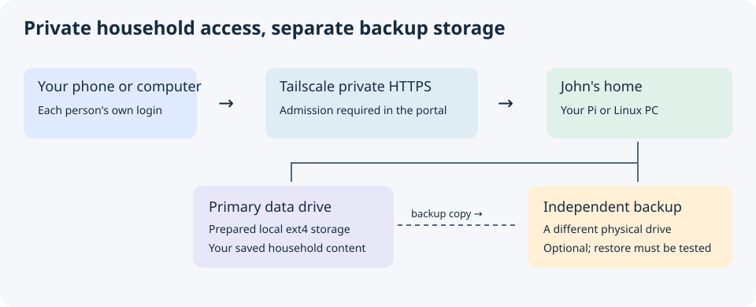
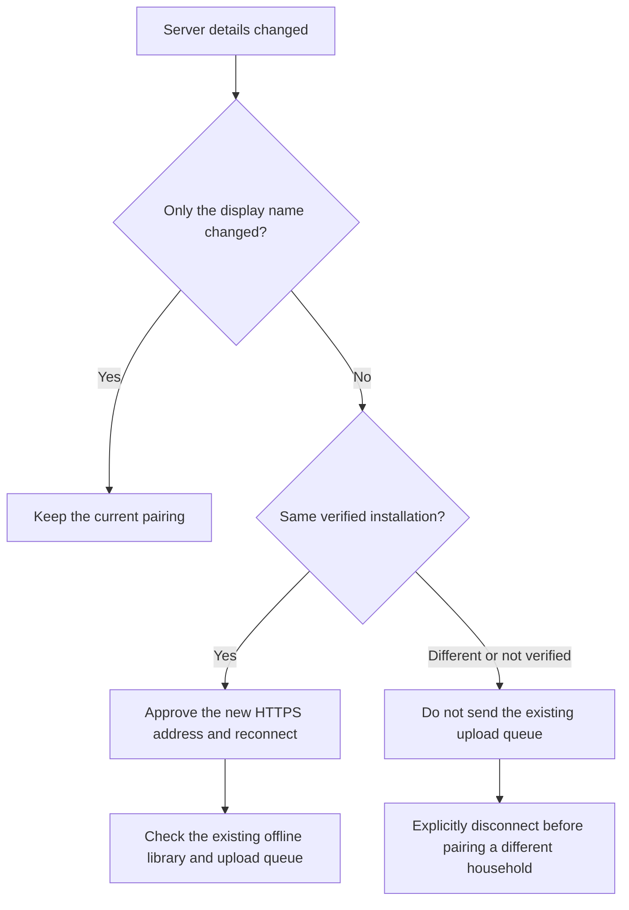

# Android companion

Use the signed **David-Pi** APK attached to the same stable GitHub release as the
server. A new portable APK remains unpublished until signing continuity and
real-device acceptance pass. Do not install a developer debug APK as an update
to your household app.

1. Install Tailscale on the Android device and sign in as your own admitted
   household identity. Open the server’s actual HTTPS address in a browser.
2. Download the signed APK from the server’s verified download link or the
   matching GitHub release. Compare the published SHA-256 if downloading manually.
3. Android may ask you to temporarily allow installation from that browser or
   file manager. Install the APK, then turn off that permission again if desired.
4. Open David-Pi and connect the household server. Approve the displayed HTTPS
   origin explicitly and complete pairing from the admitted portal identity.
5. Select media folders and grant only the permissions needed for features you
   want. If Android restricts background activity, follow the in-app battery
   guidance for scheduled backup.

The companion supports one household server at a time. The approved HTTPS
origin applies to pairing, uploads, portal navigation, downloads and playback.
An unexpected host, insecure URL or redirect must not receive your credentials.

Phone backup requires the server’s Media and Phone Backup modules. Pairing the
companion for other supported uses does not require selecting phone backup.
For scheduled uploads, keep Tailscale connected and inspect the queue after the
first run. Interrupted transfers should resume without duplicate content.
A completed upload is not evidence of a second independent backup.

For audiobooks, download a supported title while connected, confirm it appears
in the offline library, then test playback without network access. Progress is
scoped to the installation and person and synchronizes when reconnected.

A display-name change does not require new pairing. If the server address
changes, approve the new address and reconnect to the same verified installation.
Its existing offline content and queue remain associated with that installation.
To join a different household, explicitly disconnect and pair again; previous
household data and queued uploads must remain isolated.

Use this path when something about your server changes:

Install newer APKs over the existing app only when the package and signing
certificate match. Do not uninstall merely to work around a signature error,
because Android may remove local queues and offline content. Ask the maintainer
to verify release signing. Native Firebase chat alerts are not included in this
release; text chat and supported web notifications remain separate capabilities.
