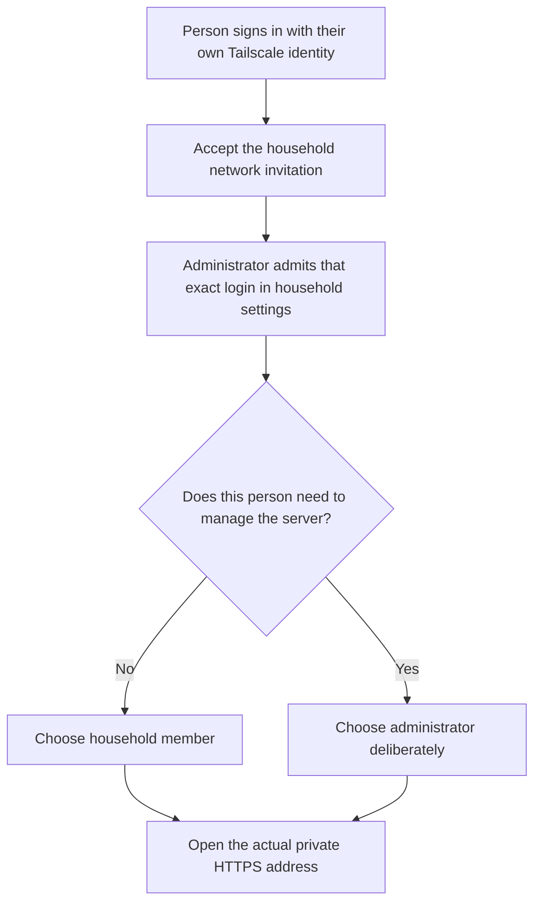

# Your household, website name and roles

The first administrator claims setup from the intended verified Tailscale
identity. Admission to the website is separate from network access. Invite
people to your Tailscale network and then add their exact Tailscale login in
household settings. Give administrator access only to people who should change
modules, integration credentials, storage, updates or membership.

Each person passes both access steps. Joining the network alone does not grant
website access or administration:



Each person signs in through Tailscale on their own device. Do not share one
Tailscale login for the whole household. Private content stays with its admitted
owner; shared content is visible only to authorized household members. Removing
an identity must revoke access rather than silently reassign their content.

The website **display name**, Tailscale **hostname**, and actual **HTTPS address**
are separate settings. “John’s home” can use the suggested hostname `john-pi`.
Tailscale may assign a collision suffix, so always use the reported address.
Changing the display name updates website titles and installed web-app metadata
without moving files or changing the installation ID. Browser shortcuts may
require reopening before their labels refresh.

If Tailscale has assigned a different hostname or tailnet address, first update
the server from a trusted local terminal. Find this node's `Self.DNSName` in
`tailscale status --json`. Remove its final dot, prefix it with `https://`, and
explicitly accept that exact address:

```sh
sudo david-pi reconnect --accept-origin https://john-pi.example-tail.ts.net
```

Replace the example with the node's actual address. This command does not rename
the Tailscale node. It refuses a disconnected node, a different accepted address,
Funnel, or a conflicting HTTPS root service. It preserves other Serve routes and
the installation ID, household, keys and content, then restarts the selected
services and checks readiness. If it fails, inspect `sudo david-pi status` before
retrying; restoring the previous configuration cannot restore a retired DNS name.
The [Tailscale Serve reference](https://tailscale.com/docs/reference/tailscale-cli/serve)
explains separately managed routes.

After the command succeeds, open the new address and update browser bookmarks.
Follow the explicit reconnect instructions on each Android device. Reconnecting
to the same verified installation preserves its
local data. Joining a different household requires disconnecting and pairing
again; it must not upload another household’s queue or reuse its credentials.

If all administrator access is lost, use a trusted local terminal with the
server’s Linux administrator account and run `sudo david-pi recover-admin LOGIN --name NAME`, using that person’s
exact Tailscale login and chosen display name.
This is a trusted local Linux administrator's admission decision; the command
does not verify who owns the entered login. Double-check it before running the
command. That person must still authenticate through Tailscale to use the website.
Do not edit the installation ID or disable access control.
