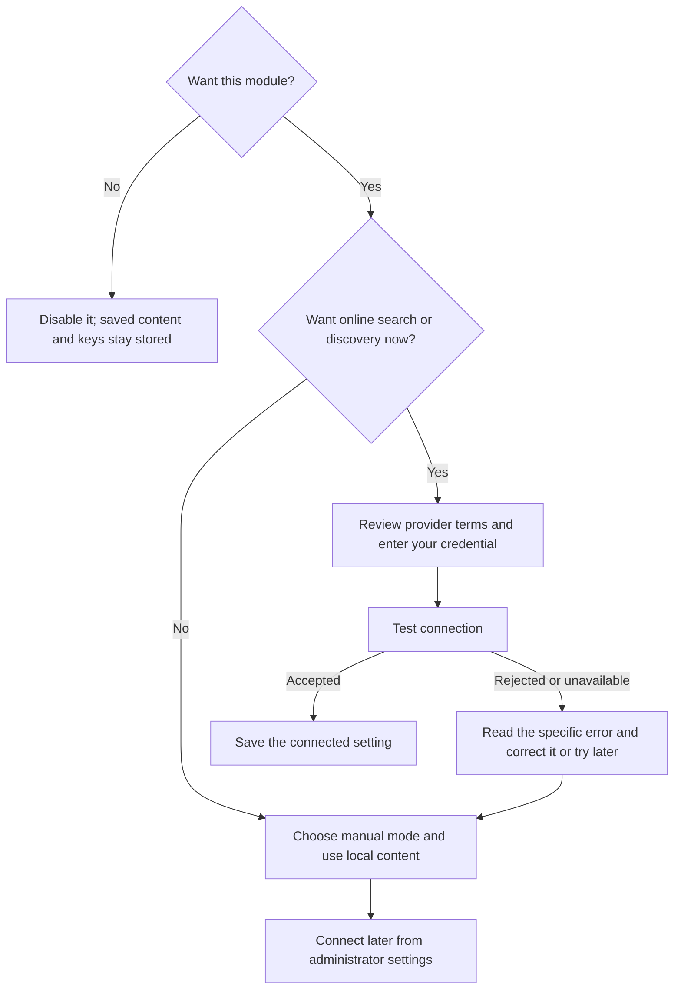

# Optional services: configure, skip, or add later

Tailscale is the only required external account. Each optional setup card
explains what it contacts and offers a connection test. Skip a provider to keep
its local features available; do not paste credentials into support messages.
Provider terms, limits and pricing can change, so review the linked account page.

| Feature | Required for its online feature | When skipped |
| --- | --- | --- |
| Movie Night search | TMDB API read token; country and selected streaming providers | Manual watchlist remains available |
| Online recipe discovery | Your provider credentials when required by its distribution terms | Create, import supported recipes and plan locally |
| Browser notifications | Opt-in per browser; locally generated VAPID keys | Chat works without push alerts |
| Pi-hole | Existing local supported Pi-hole query database | No DNS filtering integration |
| Chat | Local encryption key generated by setup | No external account needed for text and uploaded images |
| Assistant | Local help and supported read-only context | No external AI account or computer bridge |

For Movie Night and recipe discovery, decide separately whether to keep the
module and whether to connect its online provider:

## Movie Night / TMDB

1. Create a TMDB account and request API access in its account settings.
2. Review the API terms for your intended use and copy the **API Read Access Token**.
3. Paste it into the Movie Night setup card and select **Test connection**.
4. Select the country where you watch and the streaming services you subscribe to.
5. Save. Search results and availability are fetched from TMDB. Search queries,
   requested title identifiers and country may be sent to the provider.

Never enter Netflix, Disney+, Prime Video or other subscription passwords.
Country-specific provider listings do not guarantee that every title is
currently included in your plan; follow the provider link to confirm access.
An invalid token, rate limit or outage must not remove saved watchlist items.
Correct the key or retry later, or leave online search disabled.

This product uses the TMDB API but is not endorsed or certified by TMDB.
Streaming availability data is provided through TMDB by **JustWatch**. Display
the approved TMDB logo and notice in Movie Night’s Data credits, alongside
JustWatch attribution with provider results, and retain the
provider link required by the API. [TMDB access instructions](https://developer.themoviedb.org/docs/getting-started)
· [Watch-provider attribution requirements](https://developer.themoviedb.org/reference/movie-watch-providers)

## Recipes

Local recipes and planning work without online discovery. TheMealDB's public
example key is not bundled as production access. To enable discovery, obtain
credentials appropriate for your use from the [provider API page](https://www.themealdb.com/api.php),
enter them in integration settings and test the connection. Online searches send
search terms and requested recipe identifiers to that provider. Provider
availability or quota errors must leave saved local recipes intact.

## Browser notifications

Opt in separately on each supported browser after chat is working. Setup
generates local VAPID keys; keep them with the installation’s protected secrets.
Push delivery uses the browser vendor’s push infrastructure and is not purely
local. Denying browser permission does not disable chat. Re-enable permission in
the browser’s site settings and re-subscribe if needed. Native Firebase Android
chat alerts and GIF search are deferred and are not offered as configured features.

## Pi-hole

You may skip Pi-hole entirely. This release connects an **existing local**
Pi-hole instance by reading aggregate statistics from its `pihole-FTL.db` file.
Run `sudo david-pi pihole-setup` on the server and supply the absolute host path
of that existing database. With Docker, use the database path inside the host's
persistent Pi-hole volume. It does not request subscription credentials, expose
query history, install Pi-hole, or change DNS.

If you do not have Pi-hole, use the [official installation guide](https://docs.pi-hole.net/main/basic-install/)
first. Changing router/device DNS is a separate deliberate step: record previous
values, test one device, and restore those values if resolution fails.
[Pi-hole guide](PIHOLE.md)

The locally served logo is the unchanged approved TMDB asset. See [TMDB’s
attribution requirements](https://developer.themoviedb.org/docs/faq) and
[approved logos](https://www.themoviedb.org/about/logos-attribution).
