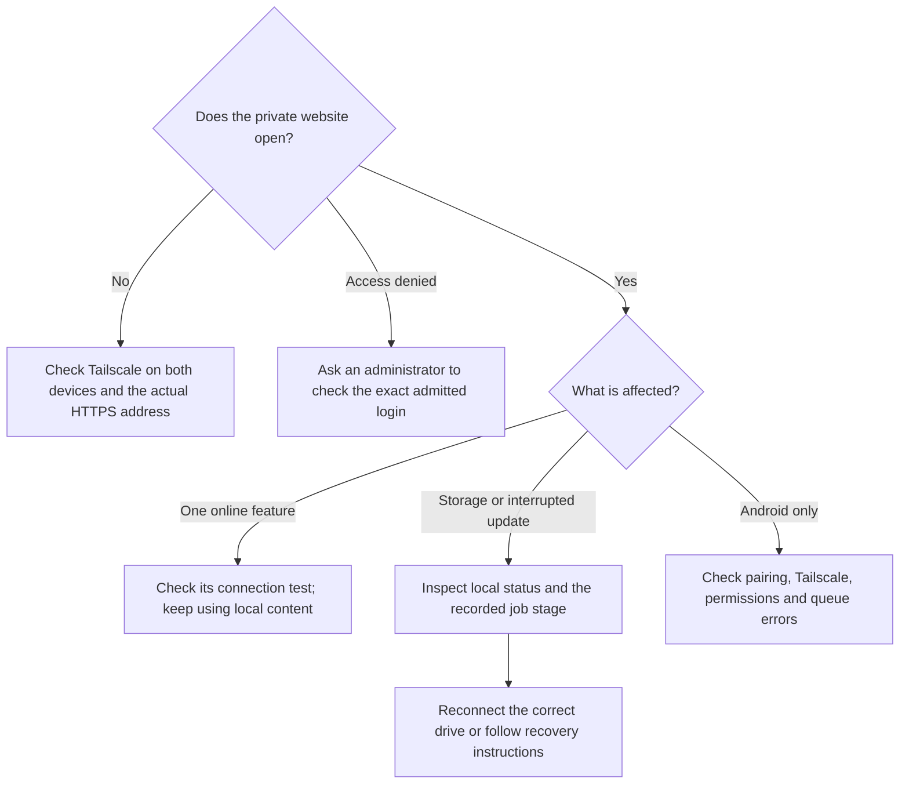

# Troubleshooting

For terminal commands below, use the **server's terminal** or an SSH session to
the server. The browser and Tailscale app can be on your separate setup device.

## Find the link or check the right account

Run `sudo david-pi address` on the server to show its saved private address. Open
that full HTTPS address on a Tailscale-connected device. This command does not
restart setup or expose the claim token. If you deliberately changed the Tailscale address, follow
the [reconnect workflow](HOUSEHOLD.md). The command shows the installation’s
saved address; it does not discover or approve a replacement automatically.

The Tailscale app's active account determines which network and identity the
browser uses to reach the portal. Logging into the Tailscale admin console with
a different browser account does not change the app. On Linux,
`tailscale switch --list` marks the active account. Check this on your setup
device as well as the server. See [account switching](TAILSCALE.md#already-using-tailscale-or-testing-in-a-separate-network).

Typing an email into setup only selects the intended administrator. If you
mistyped that address, renewing the claim code will keep the typo. Check the
account printed in the server terminal and seek help reviewing the saved setup
locally; do not delete configuration or keys to bypass the identity check.

A warning about DNS port 53 does not block ordinary home-server setup. Your
operating system may already provide a local DNS service. Leave it running;
optional Pi-hole has its own deliberate [DNS setup](PIHOLE.md).

## HTTPS or claiming has not finished

If setup requests certificates, use the Tailscale admin console's **DNS → HTTPS
Certificates → Enable HTTPS**, then finish the confirmation and verify HTTPS
is enabled. Being on the DNS page, or merely opening the confirmation, does not
complete this step. Return to the server and press Enter at the HTTPS
checkpoint. If setup has exited with an error, run `sudo david-pi setup` to resume.
See the [Tailscale guide](TAILSCALE.md#3-enable-https-certificates).

If the claim token expired before it was used, run `sudo david-pi setup` on the
server for a fresh token. The same command also renews an expired browser setup
session before installation has begun. It prints the saved private link and a
new 15-minute token directly: no repeated account/hostname questions and no
package installation. Refresh the wizard, then copy the newly printed token
into **Claim your server**. Previous codes and browser sessions are invalidated;
unsaved browser entries may need to be entered again. The 15 minutes limits
claiming ownership, not the full installation.
Use the exact intended owner's Tailscale identity. The token is entered in a
form, not appended to the address. Do not delete installation settings to fix
an account mismatch. Once installation choices have been saved, setup resumes
that installation instead of creating another household.

If renewal reports that the server's account or address changed, switch the
server's Tailscale app back to its original account and restore its original
hostname, then retry. Changing the setup device's browser login will not fix
the server's account. Renewal deliberately refuses to bind your saved setup
to a replacement address. If the move was intentional, review the saved setup
locally with support; do not delete configuration or manually replace its
identity. For an already installed server use the documented
[reconnect workflow](HOUSEHOLD.md).

If another installation operation is running, let it finish. Renewing a code
does not interrupt installation or restart services that are already running.

## Setup is slow, disconnected or failed

The **Setting up your home** bar counts completed stages, not elapsed time.
Starting services and checking their health can take longer than other stages.
On a slow machine, an unchanged stage alone does not mean setup has failed.

1. Keep the server powered on and Tailscale connected. A temporary reconnect
   message can occur as the private address changes from the setup service to
   the portal. The browser will try to reconnect.
2. If you closed the page, reopen the private address from `sudo david-pi address`.
   Use **Check again** if offered. Do not submit another installation merely
   because progress stopped updating.
3. Run `sudo david-pi status` on the server to inspect the saved operation and
   its current stage. If it is still running, allow that operation to finish.
4. If the operation is marked failed or interrupted, read the specific error.
   Reconnect a missing disk, free sufficient space, or fix the reported account,
   certificate or port issue. Then run `sudo david-pi setup` to resume. Your
   saved configuration and content remain in place.
5. When setup finishes, open the portal and confirm the chosen name and modules.
   `sudo david-pi verify` runs local checks if the page still reports a problem.

Do not delete the data directory, reset all Tailscale Serve settings, or disable
health checks to turn a failed installation into a success. If a supported
machine repeatedly fails at the same stage, include that stage and error in a
support report using the guidance below.

For developers using software-emulated VMs, startup can be much slower than
native hardware. Keep any timing adjustment recorded as test-only evidence;
an assisted VM recovery is not a completed native or newcomer acceptance test.

## Other symptoms

Start with the symptom, then use the detailed checks below:

| What you see | What to check |
| --- | --- |
| Setup URL will not open | Both devices signed in to the intended Tailscale network; actual DNS name; MagicDNS/HTTPS; existing Serve conflict |
| The command asks for an interactive terminal | Run it in a keyboard-capable terminal on the server or an interactive SSH session; answer the displayed prompts |
| A prepared drive is not listed | Attach and mount it on the server, confirm local ext4, then refresh detected locations; see [storage](STORAGE.md) |
| Tailscale address changed | At the trusted server terminal, follow [reconnect](HOUSEHOLD.md) and explicitly accept the actual origin; then reconnect Android and update bookmarks |
| Reconnect failed | Inspect `sudo david-pi status` and `tailscale serve status --json`; correct the reported conflict or storage/service failure before retrying the same explicit command |
| Claim expired or rejected | Generate a fresh token from the trusted server terminal; use the exact intended administrator identity |
| Access denied after joining Tailscale | An existing portal administrator must explicitly admit your login |
| Storage missing or wrong identity | Reconnect the correct ext4 disk and verify its UUID mount; do not fabricate a sentinel |
| Upload rejected for space | Free safe content space or expand storage; do not delete database files or active upload parts blindly |
| Movie search unavailable | Validate TMDB read token, country and quota; use saved manual watchlist while unavailable |
| Online recipes unavailable | Check provider credential/terms; local recipes remain usable |
| Chat cannot read stored content | Check the preserved installation encryption key; generating a replacement does not decrypt old messages |
| Android signature conflict | Verify original signing continuity; do not uninstall and lose local content merely to bypass it |
| Android sends nothing in background | Tailscale connected, pairing current, media permission and battery/background settings; inspect queue errors |
| Backup says restore unverified | Perform a clean restore drill and inspect actual application content |
| Maintenance degraded | Inspect bounded error code; source collector and worker schemas must match, and observation must be fresh |
| Update interrupted | Inspect persisted job stage and recovery snapshot; never restore over newer writes automatically |

Use `sudo david-pi status` and `sudo david-pi verify` for local diagnosis. When
sharing a support bundle, inspect it first and remove names, addresses, content,
keys and tokens. Do not paste full integration settings or pairing links into
public GitHub issues. Include the release version, OS/architecture, exact error,
module involved and steps to reproduce using synthetic content.
