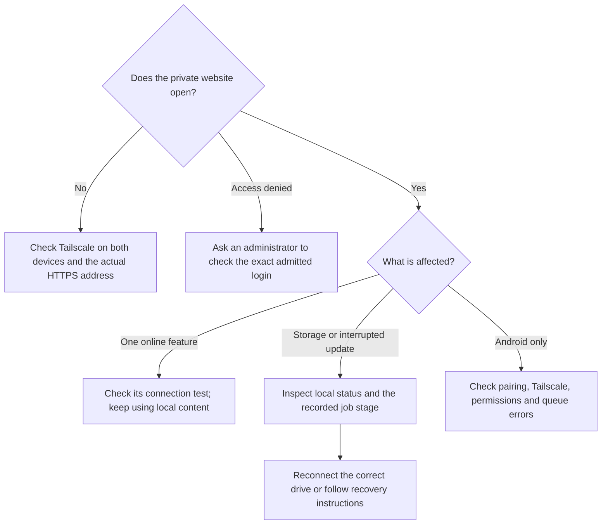

# Troubleshooting

Start with the symptom, then use the detailed checks below:

| What you see | What to check |
| --- | --- |
| Setup URL will not open | Both devices signed in to the intended Tailscale network; actual DNS name; MagicDNS/HTTPS; existing Serve conflict |
| Tailscale address changed | At the trusted server terminal, follow [reconnect](HOUSEHOLD.md) and explicitly accept the actual origin; then reconnect Android and update bookmarks |
| Reconnect failed | Inspect `sudo david-pi status` and `tailscale serve status --json`; correct the reported conflict or storage/service failure before retrying the same explicit command |
| Claim expired or rejected | Generate a fresh token from the trusted server terminal; use the exact intended administrator identity |
| Access denied after joining Tailscale | An existing portal administrator must explicitly admit your login |
| Storage missing or wrong identity | Reconnect the correct ext4 disk and verify its UUID mount; do not fabricate a sentinel |
| Upload rejected for space | Free safe content space or expand storage; do not delete database files or active upload parts blindly |
| Movie search unavailable | Validate TMDB read token, country and quota; use saved manual watchlist while unavailable |
| Online recipes unavailable | Check provider credential/terms; local recipes remain usable |
| Chat cannot read stored content | Check the preserved installation encryption key; generating a replacement does not decrypt old messages |
| Android signature conflict | Verify original signing continuity; do not uninstall and lose local content merely to bypass it |
| Android sends nothing in background | Tailscale connected, pairing current, media permission and battery/background settings; inspect queue errors |
| Backup says restore unverified | Perform a clean restore drill and inspect actual application content |
| Maintenance degraded | Inspect bounded error code; source collector and worker schemas must match, and observation must be fresh |
| Update interrupted | Inspect persisted job stage and recovery snapshot; never restore over newer writes automatically |

Use `sudo david-pi status` and `sudo david-pi verify` for local diagnosis. When
sharing a support bundle, inspect it first and remove names, addresses, content,
keys and tokens. Do not paste full integration settings or pairing links into
public GitHub issues. Include the release version, OS/architecture, exact error,
module involved and steps to reproduce using synthetic content.
