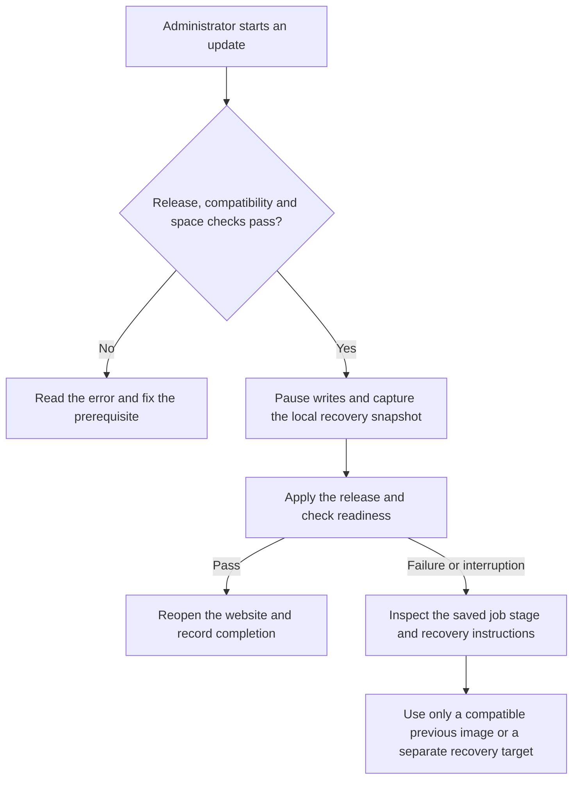

# Administrator-controlled updates

Updates start deliberately from an admitted administrator’s portal controls.
Stable installations check stable releases only. A testing prerelease is always
an explicit choice: installing a beta does not enroll stable households in beta
updates. See the testing-release instructions for moving between beta versions.
A beta may offer a newer compatible stable release once one exists.

To select a later beta deliberately, use the exact version from its published
release instructions in the server terminal:

```sh
sudo david-pi update --version 10.0.0-beta.2
```

The version above is an example, not a promise that it is published. This command
verifies that exact release and uses the same mandatory snapshot, compatibility
and readiness checks. It refuses downgrades. Ordinary website update checks
continue to select stable releases only. Do not rerun a newer bootstrap to bypass
the updater on an installed household.

Open **Settings → Updates → Check for updates**. If a newer stable release is
available, choose **Install verified update** and follow the displayed job.

Before applying an update, the server verifies compatibility and storage, pauses
application writes, captures consistent databases, configuration, keys and job
state, and retains the previous image. It reopens the website only after the
new services pass readiness checks. Progress is saved even if you close the tab.

## Where update snapshots live

By default, update recovery uses a private **sibling folder on the library’s
filesystem**, named `david-pi-recovery-<installation ID>`. It is outside the live
library and is not mounted into the portal. A library on an external drive no
longer requires a library-sized copy on the operating-system disk.

The first update snapshot needs space for a full copy of the library, consistent
database copies and at least **1 GiB free reserve**. This can take time for a large
library. Later snapshots reuse verified unchanged files from previous recovery
copies; changed files and databases get new copies. Recovery files are never
linked to live library files, so later uploads and edits cannot change a snapshot.
Each completed snapshot remains independently restorable when older snapshots
are removed. These local copies do **not** protect against drive failure.

**Settings → Update recovery storage** shows the folder, available space and
completed snapshot count. Leave the advanced folder blank to use the default.
To use another prepared local ext4 filesystem, enter a new dedicated folder under
its existing mount, then save settings. Keep it outside the live library and
independent backup folders. The filesystem’s UUID is remembered: a missing drive
must fail instead of writing a replacement snapshot to the system disk. Mount a
custom recovery drive persistently and verify it after reboot. Changing the
setting leaves old snapshots in their original location.

The operating-system disk still needs space for the downloaded release, container
images and small management records. The independent backup destination remains
a separate choice and does not change where local update snapshots are stored.

## Retention and freeing space

After an update passes readiness and the website reopens, older snapshots from
**successful** updates are removed. The newest recovery point stays. Failed,
interrupted and unknown attempts are retained for review, and no existing snapshot
is deleted to make an update pass its space check. Cleanup failure leaves the
successful update in place and reports that local review is needed.

In the server terminal, `sudo david-pi update-snapshots` lists completed snapshots
and journaled failed/incomplete attempts at the configured location. After reviewing a snapshot you no longer need, use
`sudo david-pi update-snapshots --remove SNAPSHOT_ID`. The terminal requires the
exact `REMOVE SNAPSHOT SNAPSHOT_ID` confirmation. This removes only that recovery
copy, never live content or independent backups. Removing the newest snapshot
means the next update needs a full copy again. A recorded failed or interrupted incomplete copy can also be removed by its exact
ID after the same confirmation. Unknown and legacy entries are left for local
review; do not remove unknown directories blindly.

Follow the recorded job state instead of assuming that a closed browser means
the update finished:



Do not power off intentionally during an update. If power or connectivity fails,
reopen administrator settings or run `sudo david-pi status` in the server's
terminal. Review the persisted stage and [recovery instructions](RECOVERY.md)
before retrying. `repair` recreates selected services; it is not an automatic
rollback command. A missing backup
destination does not block everyday use, but insufficient space for the local
pre-update snapshot must block the update.

Rollback is allowed only when the recorded application and data schema versions
are compatible. A previous image is not a universal undo button. If household
content changed after the recovery point, the system must refuse to silently
restore old data over it. Use a separate recovery target and compare records.

An address change is a separate local operation. If Tailscale assigned the node
a new HTTPS address, follow the [household reconnect instructions](HOUSEHOLD.md)
and run `sudo david-pi reconnect --accept-origin HTTPS_ORIGIN` with that exact
address. An ordinary update or `repair` does not approve a new address for you.
Reconnect records its own job, retains the same installation identity and content,
and checks the restarted services. A failed reconnect attempts to restore the
previous configuration and root Serve mapping; it never restores old content.

The first migration from public v9.22.2 requires a rehearsal with synthetic
fixture data and independent backup restoration. Packaging this project does
not upgrade the original live david-pi server; that migration is a separate,
rehearsed operation.
