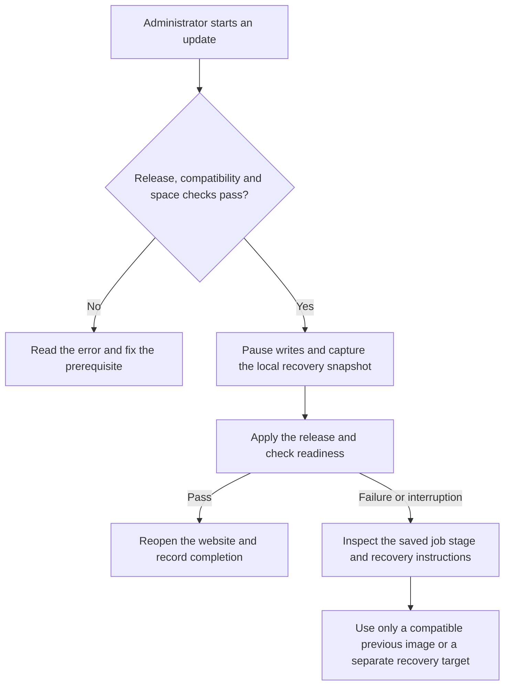

# Administrator-controlled updates

Updates start deliberately from an admitted administrator’s portal controls.
No new preview images are offered. The installer accepts only the supported
stable release metadata and verifies downloaded source/image identities.

Before applying an update, it checks compatibility and space, coordinates
application writes, captures consistent databases/configuration/secrets/job
state, and retains the previous image and configuration. Jobs persist with
visible progress, so closing the browser must not turn success into a guess.
After migrations, readiness checks must pass before normal writes resume.

Follow the recorded job state instead of assuming that a closed browser means
the update finished:

Do not power off intentionally during an update. If power or connectivity fails,
reopen administrator settings or inspect the local management CLI. Review the
persisted stage and recovery instructions before retrying. A missing backup
destination does not block everyday use, but insufficient space for the local
pre-update snapshot must block the update.

Rollback is allowed only when the recorded application and data schema versions
are compatible. A previous image is not a universal undo button. If household
content changed after the recovery point, the system must refuse to silently
restore old data over it. Use a separate recovery target and compare records.

An address change is a separate local operation. If Tailscale assigned the node
a new HTTPS address, follow the [household reconnect instructions](HOUSEHOLD.md)
and run `sudo david-pi reconnect --accept-origin HTTPS_ORIGIN` with that exact
address. An ordinary update or `repair` does not approve a new address for you.
Reconnect records its own job, retains the same installation identity and content,
and checks the restarted services. A failed reconnect attempts to restore the
previous configuration and root Serve mapping; it never restores old content.

The first migration from public v9.22.2 requires a rehearsal with synthetic
fixture data and independent backup restoration. Packaging this project does
not upgrade the original live david-pi server; that migration is a separate,
rehearsed operation.
